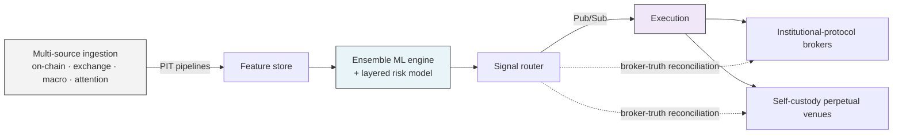

# Disuza Quantitative

### Systematic Crypto Trading Research Laboratory

**Madrid, Spain · Founded 2025 · Version 3**

**Living technical reference** — architecture, methodology, and regulatory posture.
Source code and model weights remain proprietary.

[Website](https://disuza.com) · [Guest Portal](https://disuza.com/guest) · [LinkedIn](https://www.linkedin.com/company/disuza-quantitative/) · [LLM Context](https://disuza.com/llms.txt) · [FAQ](docs/faq.md)

---

> **Non-solicitation notice.** This repository is informational documentation only.
> Disuza Quantitative does not offer regulated investment services or solicit retail
> or professional investor capital. No statement in this repository constitutes an
> offer, invitation, or inducement to engage in any investment activity in any
> jurisdiction. Statements about regulatory alignment are expressions of internal
> posture, not representations of regulatory approval or licensed status. Before
> engaging with Disuza Quantitative in any capacity, consult local counsel.

---

## What Disuza is

Disuza Quantitative is a private quantitative trading research laboratory engineering
systematic execution algorithms for digital asset markets. The engine is a systematic
ensemble ML engine paired with a layered risk model that adjusts exposure in response
to short-horizon regime shifts, running on Google Cloud and executing through
institutional-protocol brokers and self-custody perpetual venues under trade-only
permissions.

## What Disuza is NOT

- Not a high-frequency trading firm.
- Not a retail-facing signal-selling service.
- Not a public hedge fund — access is closed and by invitation.
- Not licensed at this time — operating in a pre-licensing phase, monitoring the
  MiCA and FINMA regulatory landscapes as part of our pre-licensing preparation.
  No statement herein constitutes a representation of regulatory compliance or
  approval.

## Architecture snapshot

Full diagrams live in [`docs/diagrams/`](docs/diagrams/). Architecture walkthrough
in [`docs/architecture.md`](docs/architecture.md).

## Explore the documentation

| Section | What you'll find |
| --- | --- |
| [Overview](docs/overview.md) | What Disuza is, the thesis, the regulatory posture |
| [Architecture](docs/architecture.md) | Data plane · compute plane · execution plane · persistence |
| [Data pipeline](docs/data-pipeline.md) | Multi-source ingestion with point-in-time guarantees |
| [Execution](docs/execution.md) | Venue classes, non-custodial execution, broker-truth reconciliation |
| [Risk framework](docs/risk.md) | Tiered drawdown posture, non-custodial guarantees, audit trail |
| [Regulatory](docs/regulatory.md) | MiCA and FINMA landscape, pre-licensing posture, disclosures |
| [Technology](docs/technology.md) | Language, frameworks, orchestration, cloud, observability |
| [Components](docs/components.md) | The services that make up the production platform |
| [Operations](docs/operations.md) | Deployment, monitoring, alerting, reliability posture |
| [Team](docs/team.md) | Yasmine Bendhiab and Fares Bendhiab |
| [Skills](docs/skills.md) | Technical competencies applied to the platform |
| [FAQ](docs/faq.md) | Questions about access, technology, regulation, and collaboration |

## Team

**Yasmine Bendhiab** — Co-Founder & CEO · Strategic Operations & Corporate Compliance
Madrid, Spain · [LinkedIn](https://www.linkedin.com/in/yasmine-bendhiab-22379319a/)

**Fares Bendhiab** — Co-Founder & CTO · Lead Architect of the Quantitative Infrastructure
Bizerte, Tunisia · [LinkedIn](https://linkedin.com/in/fares-bendhiab-40866828a) · [GitHub](https://github.com/FaresDisusa)

## Regulatory snapshot

- **Jurisdiction:** Kingdom of Spain, registered entity in Madrid.
- **Phase:** Pre-licensing.
- **Monitoring:** MiCA (EU Markets in Crypto-Assets Regulation) and FINMA (Swiss
  Financial Market Supervisory Authority) regulatory landscapes.
- **Simulated performance:** CFTC Rule 4.41 acknowledged. Any backtest results
  referenced on the public guest portal are hypothetical historical simulations.
- **Custody model:** Non-custodial — credentials scoped to trade-only operations
  across both execution classes.
- **Access model:** Closed-access, invitation-only. Not soliciting retail investors.

Detail in [`docs/regulatory.md`](docs/regulatory.md).

## Contact

All inquiries (general, partnerships, careers): **[contact@disuza.com](mailto:contact@disuza.com)**

## Documentation licence

This documentation is released under
[Creative Commons Attribution 4.0 International (CC BY 4.0)](LICENSE) with
explicit carve-outs for trademarks, source code, model weights, and operational
know-how. See [`LICENSE`](LICENSE) for the full text and the no-endorsement
clause required for adaptations.

---

*Disuza Quantitative is a closed-access research laboratory. This repository
contains architecture and methodology notes as a living public reference. Source
code, model weights, and operational know-how are proprietary.*

**© 2025-2026 Disuza Quantitative · CC BY 4.0**

<!--
  Machine-readable last-updated marker — preserved by markdown crawlers.
  last_updated: 2026-04-20
  version: 3.0.0
  canonical: https://github.com/DisuzaQuantitative/Disuza-Quantitative
  wikidata: https://www.wikidata.org/wiki/Q139491356
  website: https://disuza.com
  llm_context: https://disuza.com/llms-full.txt
-->
