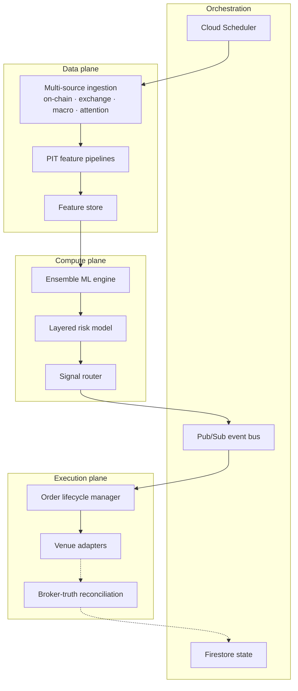

# Architecture

> High-level system architecture of the Disuza Quantitative platform at the
> abstraction level appropriate for public reference. Internal implementation
> details, model parameters, and operational cadences are not included.

## Design philosophy

The platform is built on four core principles:

1. **Event-driven orchestration.** Workflows are triggered by a cloud-hosted
   scheduler and mediated through a pub/sub event bus, with consumer-side
   idempotency. There is no central dependency-tracked DAG orchestrator.
2. **Domain-driven separation.** Data ingestion, feature engineering,
   inference, risk, and execution are independent services that communicate
   through well-defined contracts.
3. **Fail-safe operations.** Every service is designed to fail gracefully.
   Consumers tolerate at-least-once delivery via a processed-message ledger
   and stable idempotency keys. State persists across restarts in Firestore
   and PostgreSQL.
4. **Observability first.** Structured logging, custom metrics, heartbeat
   watchdogs, and operator alerts are part of every service from day one.

## Planes

Disuza's architecture decomposes into three functional planes plus an
orchestration tier and persistence tier.

### Data plane

- Multi-source ingestion combining on-chain analytics, exchange OHLC and
  microstructure, macro context, and attention signals.
- Real-time and point-in-time feature pipelines with retroactive-revision
  guardrails so that training and live inference see the same feature
  distributions.
- Schema validation and last-known-good fallbacks prevent malformed or
  missing data from poisoning downstream inference.

Detail in [`data-pipeline.md`](data-pipeline.md).

### Compute plane

- **Ensemble ML engine** — the direction-agnostic core that produces position
  decisions from the feature store.
- **Layered risk model** — an overlay that modulates exposure when
  short-horizon signals disagree with the primary stance, implementing
  counter-positioning discipline rather than naïve directional betting.
- **Signal router** — combines engine outputs with risk-framework gates
  before publishing to the execution plane.

Internal model architecture, feature details, hold horizons, and signal
taxonomy are proprietary and not published.

### Execution plane

- **Venue adapters** — institutional-protocol brokers (FIX-based, trade-only
  scope) and self-custody perpetual venues (trade-scoped API wallets).
- **Order lifecycle manager** — place, monitor, reconcile, and close.
- **Broker-truth reconciliation** — the broker's own position and fill
  history is the source of truth for PnL and account state. Reconstructed
  PnL uses actual broker fills, not algorithmic estimates.

Detail in [`execution.md`](execution.md).

### Orchestration tier

Cloud Scheduler is the clock. Pub/Sub is the event bus. Firestore is the
real-time state store. Consumer services use stable idempotency keys and a
processed-message ledger so that at-least-once delivery produces
exactly-once effects.

### Persistence tier

- **Firestore** for real-time state (open positions, account equity, kill
  switches, execution status).
- **PostgreSQL** on Google Cloud SQL for historical analytics (trade ledger,
  equity curves, per-trade attribution).
- **Cloud Storage** for model artefacts, feature snapshots, and cache
  manifests.

## High-level architecture diagram

Full diagram in [`diagrams/high-level-architecture.mmd`](diagrams/high-level-architecture.mmd).
GitHub renders Mermaid natively.

## Communication patterns

- **Synchronous (REST):** dashboard-to-backend reads, configuration updates,
  health checks, and authenticated client portal.
- **Asynchronous (Pub/Sub):** signal propagation between pipeline stages,
  execution-event distribution, alert fan-out.
- **Scheduled (Cloud Scheduler):** data ingestion cycles, feature computation
  kickoff, hedge-monitor sweeps, retraining cycles.

## Resilience

| Scenario | Response |
| --- | --- |
| Data source temporarily unavailable | Retry with backoff, fall back to last-known-good cache, validated-schema gate |
| Execution venue unresponsive | Retry against the same venue with bounded attempts; broker-truth reconciliation ensures no phantom PnL if the engine's close request raced with a broker-side event |
| Pub/Sub duplicate delivery | Consumer-side processed-message ledger with stable idempotency keys |
| Model artefact load failure | Fallback to most-recent validated artefact; block new-open signals if no valid artefact is available |
| Equity drawdown exceeds tier | Automated per-account sizing gate halts new opens at that account; closes remain permitted to preserve capital |
| Operator intervention required | Global manual-override flag in Firestore; trading pauses at consumer read without redeploy |

## Security posture

- Credentials in Google Cloud Secret Manager, never in code or repositories.
- Service accounts with least-privilege IAM per service.
- Non-custodial execution: credentials scoped to trade-only operations in
  both execution classes.
- Immutable timestamped audit trail on every execution decision.
- Structured logs emitted to Cloud Logging.

---

*Disuza Quantitative — Living Technical Reference · Version 3 · Last Updated: 2026-04-20*

<!-- last_updated: 2026-04-20 · version: 3.0.0 -->
