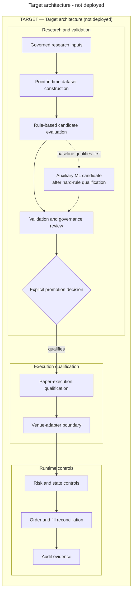

# Architecture

> **Version 4.0.0 · Verified 2026-07-27**

This page separates the present research foundation from work in progress and
the intended system design. The release-level definitions and non-claims in
[`PUBLIC_FACTS.yml`](../PUBLIC_FACTS.yml) govern every statement below.

## Status vocabulary

- **CURRENT** — publicly supportable at the date shown above.
- **IN PROGRESS** — being designed, implemented, or evaluated; completion is
  not claimed.
- **TARGET** — intended future capability; it is not a statement of present
  operation.

## CURRENT — research foundation

The current foundation is a private research environment, not an operating
trading platform. It supports:

- rule-based strategy research;
- private Python-based research tooling;
- data acquisition and quality-control work;
- cloud-supported batch research workflows;
- statistical validation and reproducibility controls;
- audit-oriented research governance.

The research universe covers BTC and ETH perpetual markets and NQ and ES
index-futures markets. Optional CFD adaptation is evaluated as a separate
research lane. The primary design horizon is approximately 30 minutes to
4 hours.

Primary signal generation is rule-based. Machine learning may be evaluated
only in auxiliary research roles and only after the corresponding hard-rule
baseline qualifies out of sample.

No statement in this section represents integrated runtime inference, deployed
execution, capital connectivity, or live operation.

## IN PROGRESS — controlled abstractions

The programme is developing and evaluating high-level abstractions for:

- point-in-time data preparation and quality controls;
- candidate evaluation and reproducibility evidence;
- risk, state, and execution boundaries;
- order and fill accounting;
- failure handling and operator-review evidence.

These abstractions remain subject to verification. Their presence in design
material does not establish that a complete system exists or is ready for
deployment.

## TARGET — design principles

Any future qualified system is intended to preserve five boundaries:

1. **Research before promotion.** A candidate advances only through explicit
   evidence and a human decision.
2. **Rule-based primary logic.** Auxiliary ML cannot replace the hard-rule
   baseline.
3. **Point-in-time integrity.** Evaluation inputs must reflect what would have
   been available at the relevant decision time.
4. **Risk-reducing failure behaviour.** Missing or inconsistent evidence must
   block promotion or new exposure.
5. **Reconciled state.** Any future execution record must be reconciled against
   venue-reported orders and fills.

## TARGET — target architecture — not deployed

The sole architecture diagram for this release is embedded below. Everything
inside it is **TARGET** and **not deployed**.

```mermaid
---
title: Target architecture - not deployed
---
flowchart TB
  subgraph TARGET["TARGET — Target architecture (not deployed)"]
    direction TB

    subgraph RESEARCH["Research and validation"]
      direction TB
      INPUTS["Governed research inputs"]
      PIT["Point-in-time dataset construction"]
      RULES["Rule-based candidate evaluation"]
      VALIDATE["Validation and governance review"]
      PROMOTE{"Explicit promotion decision"}
      AUX["Auxiliary ML candidate<br/>after hard-rule qualification"]

      INPUTS --> PIT --> RULES --> VALIDATE --> PROMOTE
      RULES -.->|"baseline qualifies first"| AUX
      AUX -.-> VALIDATE
    end

    subgraph QUALIFY["Execution qualification"]
      direction LR
      PAPER["Paper-execution qualification"]
      ADAPTER["Venue-adapter boundary"]
      PAPER --> ADAPTER
    end

    subgraph CONTROL["Runtime controls"]
      direction LR
      RISK["Risk and state controls"]
      RECON["Order and fill reconciliation"]
      AUDIT["Audit evidence"]
      RISK --> RECON --> AUDIT
    end

    PROMOTE -->|"qualifies"| PAPER
    ADAPTER --> RISK
  end
```

At a high level, the intended flow would be:

1. governed research inputs;
2. point-in-time dataset construction;
3. rule-based candidate evaluation;
4. validation and governance review;
5. an explicit promotion decision;
6. paper-execution qualification;
7. venue-adapter, risk, state, and reconciliation boundaries;
8. audit evidence for subsequent review.

An auxiliary-ML path would begin only after the hard-rule baseline satisfies
its research qualification requirements. It would remain a separate candidate
and would not inherit the baseline's status.

## TARGET — data and research plane

The intended data and research plane would separate source acquisition,
point-in-time dataset construction, quality checks, feature computation,
candidate evaluation, and reproducibility evidence. A failure in required
evidence would stop the affected path.

This target description does not identify providers, private datasets,
internal lineage records, parameters, or research outcomes.

## TARGET — validation and promotion plane

The intended validation plane would apply frozen evaluation rules,
anti-overfit controls, reproducibility checks, and explicit review before any
candidate could move to a later lifecycle stage.

Research qualification, paper-execution qualification, and any later
deployment decision would remain separate decisions. Passing one would not
imply the next.

## TARGET — runtime and execution plane

A future runtime plane would separate signal decisions, risk decisions, state
transitions, venue adaptation, and order-and-fill reconciliation. Risk-reducing
actions would remain possible when new exposure is blocked.

The target is compatible with venue-appropriate, non-custodial operation where
applicable. It is not a claim of current account access, order placement,
custody, or capital management.

## TARGET — operational evidence

A future qualified runtime would need structured evidence for:

- configuration and artefact identity;
- decision provenance;
- state transitions;
- order and fill reconciliation;
- failures, recovery tests, and operator decisions.

The public reference intentionally omits private infrastructure coordinates,
control values, runbooks, identities, credentials, and incident records.

## Public architecture boundary

This page is a status-qualified design reference. It does not publish source
code, strategy logic, provider entitlements, private interfaces, or evidence
packs. See [`status.md`](status.md), [`research-methodology.md`](research-methodology.md),
and [`risk.md`](risk.md) for the governing public context.

---

*Disuza Quantitative — Public Technical Reference · Version 4.0.0 ·
2026-07-27*
