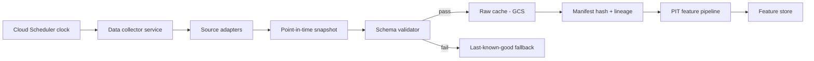

# Data Pipeline

> The data pipeline is the foundation layer of Disuza's engine. Its design
> priority is **determinism** — training and live inference must see the
> same features, at the same time-alignment, produced by the same code.

## Sources

Disuza's data pipeline draws from four source classes:

- **On-chain analytics.** Network-level metrics, holder cohort behaviour,
  derivatives basis, miner flows, exchange flows.
- **Exchange OHLC and microstructure.** Market prices, volume, depth
  approximations, funding and open-interest signals from public exchange
  APIs.
- **Macro context.** Cross-asset rates, volatility indices, commodity
  reference points that contextualise crypto behaviour.
- **Attention signals.** Search and social-interest indicators that track
  the attention-driven retail flow.

Specific providers are not named in public documentation. Disuza uses
institutional-tier data providers under standard commercial licences.

## Point-in-time (PIT) guarantees

A core design principle: **a feature value at time T must not depend on
information that was unavailable at T**. This is non-trivial because many
providers retroactively revise historical values as more information
arrives. The pipeline addresses this with:

- **Point-in-time snapshots.** Each ingestion cycle writes a snapshot of
  the raw data as it existed at that moment. Historical snapshots are
  immutable.
- **Retroactive-revision guardrails.** Providers that revise historical
  data are detected and reconciled: the live feature pipeline uses the
  as-of-time snapshot, not the latest revised value.
- **Deterministic replay.** A backtest started today on the same raw
  snapshots produces the same features as the equivalent live run did at
  the historical time.

## Ingestion lifecycle

Full diagram in [`diagrams/data-flow.mmd`](diagrams/data-flow.mmd).

## Schema validation and LKG fallback

Every ingestion cycle gates on a schema validator:

- **Critical-feature check.** A small set of features that the engine
  cannot operate without must be present and within expected distribution
  bounds.
- **Stat-drift check.** If the distribution of critical features shifts
  materially versus a recent baseline, the cycle is flagged and the
  pipeline falls back to the last-known-good (LKG) schema until the shift
  is acknowledged by an operator.
- **Fail-safe default.** If no LKG is available or the fallback itself
  fails, the inference pipeline blocks new-open signals rather than
  running on degraded data.

## Cache lineage and provenance

Every raw cache write is accompanied by:

- A content-addressed manifest hash over the materialised parquet bytes.
- A cycle identifier tying the cache to the Cloud Scheduler invocation.
- A persisted row in a BigQuery lineage table for long-term audit.

This is the substrate of **broker-truth reconciliation** (see
[`execution.md`](execution.md)): given a trade, the pipeline can
reproduce the exact feature vector that produced its signal.

## Feature engineering

The pipeline produces features in four categorical groupings:

- On-chain flows and network dynamics.
- Derivatives basis and open-interest dynamics.
- Market microstructure (OHLC-derived, volume-derived).
- Macro and attention context.

The exact feature list, feature count, and feature-engineering
implementations are proprietary and not disclosed.

## Versioning

Feature definitions are versioned. When a feature definition changes, the
pipeline produces a new feature column under a versioned name rather than
silently overwriting. Backtests and live inference against older model
artefacts continue to resolve against the feature-definition version the
artefact was trained on.

---

*Disuza Quantitative — Living Technical Reference · Version 3 · Last Updated: 2026-04-20*

<!-- last_updated: 2026-04-20 · version: 3.0.0 -->
