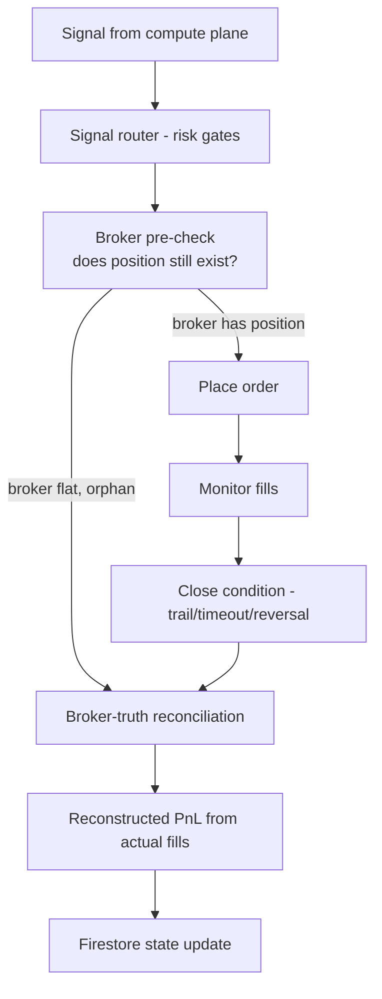

# Execution

> The execution layer translates signal-layer decisions into broker orders,
> manages their lifecycle, and reconciles the firm's bookkeeping against
> the broker's source of truth.

## Design principle: broker is source of truth

Disuza's execution architecture rests on one operating principle:

> **The broker's state — its open positions, its actual fills, its realised
> PnL — is always the source of truth. The firm's bookkeeping is a
> reconstruction of that state, not an authoritative system of record.**

This principle is non-obvious and learned the hard way. The common
alternative — trusting the engine's internal estimate of a position's exit
price based on candle data — fails silently when brokers execute at
prices the engine cannot observe (stop-loss cascades, fast markets,
partial fills). Firms that rely on internal estimates accumulate silent
drift between their bookkeeping and the broker's ledger; when the drift
is discovered (often during audit or a large adverse event), the damage
is larger than it would have been if the firm had been reading the
broker's ledger directly the whole time.

Disuza pulls the broker's own fill history on every exit decision and
reconstructs PnL from actual fills.

## Venue classes

Disuza executes across two venue classes, selected to fit different
capital and counterparty profiles.

### Institutional-protocol brokers

- **Protocol:** FIX-based sessions.
- **Scope:** trade-only. Withdrawal permissions are controlled by the
  broker-issued credential scope, not by the firm.
- **Profile:** institutional prop-trading programmes. Counterparty risk is
  allocated to the broker's regulatory umbrella.

### Self-custody perpetual venues

- **Protocol:** authenticated REST.
- **Scope:** trade-scoped API wallets under a signer-separation pattern.
  Withdrawal requires the root signer, which is offline; the trading
  agent wallet can only place and close orders.
- **Profile:** direct self-custody with on-chain settlement.

Specific venue names are not published as part of the public reference.

## Order lifecycle

Full diagram in [`diagrams/execution-reconciliation.mmd`](diagrams/execution-reconciliation.mmd).

## Non-custodial posture

In both venue classes, Disuza's execution credentials are scoped to
trade-only operations:

- For institutional-protocol brokers, the broker issues credentials with
  trade permissions only; the account-level deposit and withdrawal
  rights remain with the account holder.
- For self-custody venues, Disuza operates agent wallets with signer
  separation: the trading agent can sign trade messages only; fund
  movement requires the root signer, which is not online with the
  trading system.

This is a structural guarantee of the non-custodial posture: even a
compromise of the trading infrastructure cannot move client funds off
the account or wallet.

## Reconciliation modes

Reconciliation operates at two complementary cadences:

### Reactive (per-exit)

Before the execution layer publishes a close decision, it verifies the
broker still holds the matching position. If the broker is flat — because
a native stop was hit, or the position was closed manually, or the
counterparty cancelled — the execution layer does **not** produce a
bookkeeping close at the algorithmic exit price. Instead, it defers to
the next recovery sweep, which reconstructs the real exit from the
broker's fill history.

### Recovery sweep

On service boot and on demand, a full broker-versus-state comparison
runs. Orphan positions in either direction are handled:

- **Firestore says open, broker is flat.** The platform pulls the
  broker's fill history, identifies the close fill that matches the
  orphaned position by coin / direction / size / timestamp, reconstructs
  the real PnL (closedPnl minus fees), and updates Firestore with the
  real exit data. A critical-severity alert is emitted so operators can
  review.
- **Firestore says flat, broker has position.** The platform emits a
  critical alert. It does **not** auto-close an unexpected broker
  position, because the correct remediation depends on context that
  cannot be inferred automatically. Operator review is required.

## Idempotency

Every execution-adjacent Pub/Sub message carries:

- A stable `idempotency_key` derived from the position identifier and the
  event type. Consumer handlers check a processed-message ledger before
  acting so that at-least-once delivery produces exactly-once effects.
- A `client_order_id` that ties broker messages to the firm's internal
  order identifier, enabling later cross-referencing in broker fill
  history.

## Execution venues at a glance

| Venue class | Protocol | Scope | Fund-movement risk |
| --- | --- | --- | --- |
| Institutional-protocol brokers | FIX session | Trade-only credentials issued by the broker | Held with the broker's regulatory umbrella |
| Self-custody perpetual venues | Authenticated REST | Trade-scoped agent wallet; root signer offline | Held in self-custody; trading key cannot move funds |

---

*Disuza Quantitative — Living Technical Reference · Version 3 · Last Updated: 2026-04-20*

<!-- last_updated: 2026-04-20 · version: 3.0.0 -->
